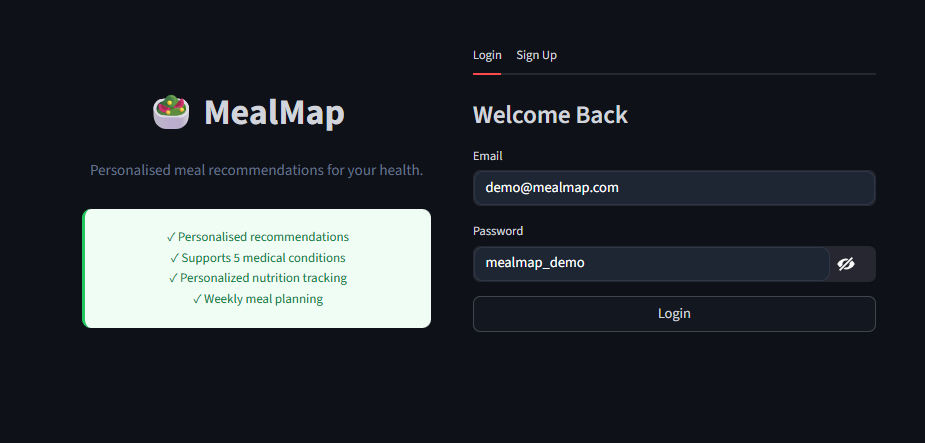
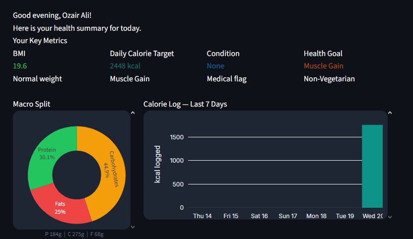
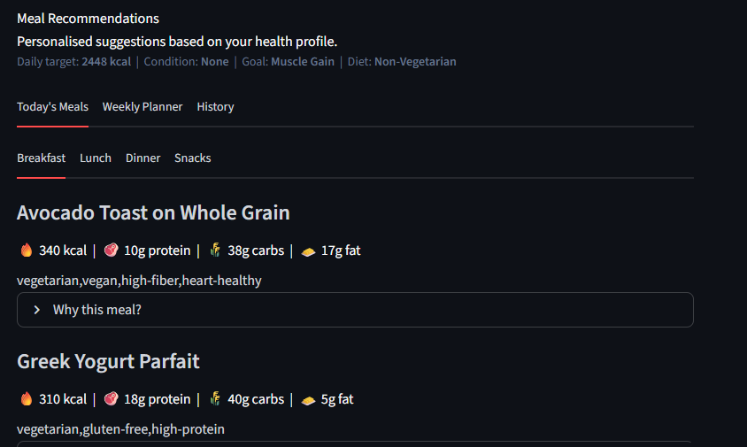
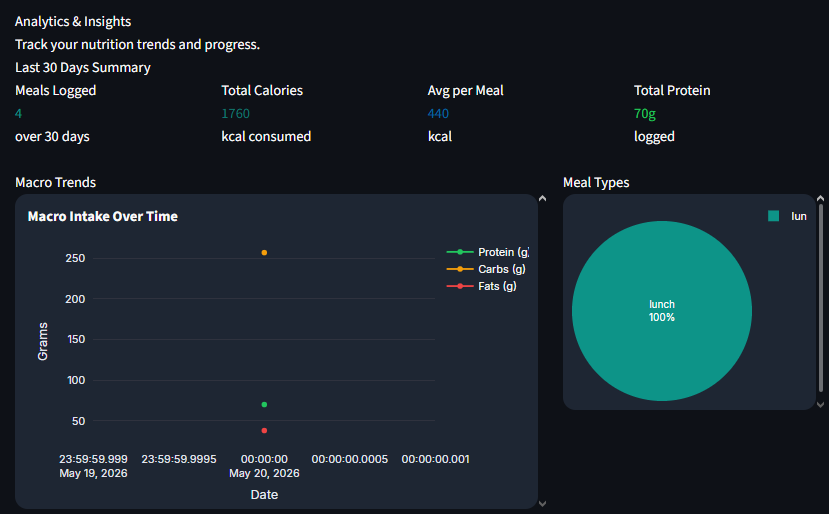

### MealMap

Personalized meal recommendation system for users with specific health conditions and fitness goals.

## Live Demo

[Open MealMap](https://mealmap-g4jcgipkpcnfynzdpp3cmw.streamlit.app)

## Features

- Disease-specific meal recommendations
- BMI, BMR, and calorie target calculations
- Weekly meal planning
- MongoDB-based user profiles
- Authentication system
- Nutrition analytics dashboard

## Supported Conditions

- Diabetes
- Hypertension
- Obesity
- PCOS
- Kidney Disease

## Tech Stack

- Python
- Streamlit
- MongoDB Atlas
- Plotly
- Pandas

## Demo Login

Use the following credentials to explore the app:

Email: demo@mealmap.com  
Password: mealmap_demo

## Screenshots

### Login Page


### Dashboard


### Recommendations


### Analytics


## Local Setup

```bash
pip install -r requirements.txt
python -m streamlit run app.py
```
